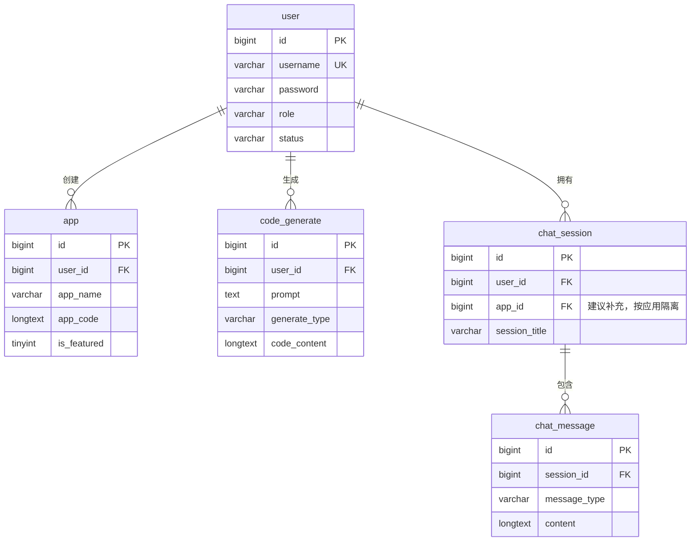
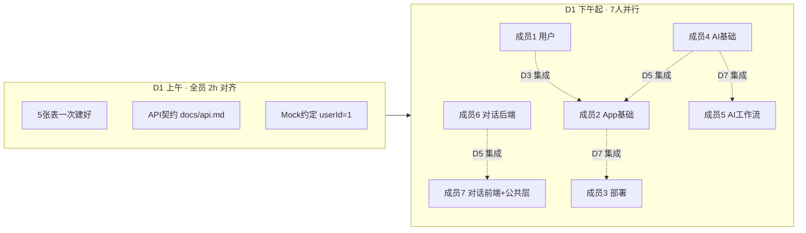
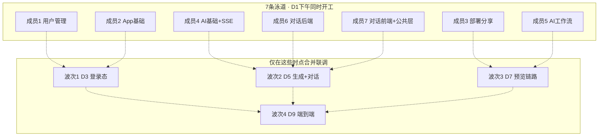

# 团队分工（7 人小组 · 并行开发版）

> 基于《大模型代码应用生成平台实训方案 v2.0》与 `01项目总览.md` 制定。  
> **核心原则**：7 人**同时开工、尽量少互相等待**——接口先行、Mock 解耦、文件边界清晰、分波次集成。

**文档导航**

| 章节 | 内容 |
|------|------|
| §二 | 数据库 5 张表设计 |
| §三 | 七人并行策略（Mock、文件边界、集成波次） |
| §五 | 各成员交付清单（P0/P1/P2） |
| **§六** | **各成员工作与实现指南（做什么 + 怎么做）** ← 开发主文档 |
| §七–§八 | 接口契约、15 天节奏 |
| §十一 | 答辩 Demo 脚本 |

## 一、四大核心模块

| 模块 | 核心能力 | 关键技术 |
|------|---------|---------|
| 智能代码生成 | 用户输入需求 → AI 分析策略 → 工具调用生成代码 → 流式输出进度 | LangChain4j、LangGraph4j、SSE |
| 用户管理 | 注册 / 登录 / 权限控制 | Spring Security、JWT |
| 应用管理 | 创建 / 编辑 / 部署 / 分享应用（Vue / 原生 HTML 等多技术栈） | JPA、Nginx、Selenium |
| 对话历史 | 多轮对话上下文持久化 | Redis、MySQL |

## 二、数据库表设计（5 张表全部可用）

> 当前 `sql/init.sql` 仅创建了数据库，**尚未建表**。图片中的 5 张表与四大核心模块一一对应，**建议全部使用**。

### 2.1 表与模块对应关系

| 数据表 | 是否使用 | 对应模块 | 负责成员 | 说明 |
|--------|:--------:|---------|:--------:|------|
| `user` | ✅ | 用户管理 | 成员 1 | 注册/登录/权限，其他表均通过 `user_id` 关联 |
| `app` | ✅ | 应用管理 | 成员 2、3 | 应用 CRUD、精选、封面、代码存储、部署分享 |
| `code_generate` | ✅ | 智能代码生成 | 成员 4、5 | 记录每次 AI 生成的 prompt、类型、完整代码 |
| `chat_session` | ✅ | 对话历史 | 成员 6 | 一次连续对话的会话元数据（标题、时间） |
| `chat_message` | ✅ | 对话历史 | 成员 6、7 | 会话内每条 user/ai 消息明细 |

**为什么需要 5 张表，而不是只有 `user`？**

| 若只有 user 表 | 缺少的能力 |
|---------------|-----------|
| 无 `app` | 无法管理「我的应用」、精选广场、部署分享 |
| 无 `code_generate` | 无法追溯 AI 生成历史、生成类型（HTML/Vue/工作流） |
| 无 `chat_session` / `chat_message` | 无法持久化多轮对话、游标分页查历史 |

**Redis 与 MySQL 的分工**（对话历史模块）：

| 存储 | 职责 | 负责成员 |
|------|------|:--------:|
| Redis | 多轮对话**实时上下文**（ChatMemory、TTL、按应用隔离） | 成员 6 |
| MySQL `chat_session` + `chat_message` | 对话**长期存档**、历史列表、游标分页查询 | 成员 6、7 |

### 2.2 ER 关系图



### 2.3 各表字段说明（按设计图）

#### `user` 用户表 → 成员 1

| 字段 | 类型 | 约束 | 说明 |
|------|------|------|------|
| id | bigint | 主键、自增 | 用户唯一 ID |
| username | varchar(50) | 唯一、非空 | 登录用户名 |
| password | varchar(100) | 非空 | 加密后的密码（BCrypt） |
| nickname | varchar(50) | 可空 | 用户昵称 |
| avatar | varchar(255) | 可空 | 头像地址 |
| role | varchar(20) | 非空 | `user` 普通用户 / `admin` 管理员 |
| status | varchar(20) | 默认正常 | `normal` 正常 / `disabled` 禁用 |
| create_time | datetime | 非空 | 创建时间 |
| update_time | datetime | 非空 | 更新时间 |

#### `app` 应用表 → 成员 2（基础）、成员 3（部署扩展）

| 字段 | 类型 | 约束 | 说明 |
|------|------|------|------|
| id | bigint | 主键、自增 | 应用 ID |
| user_id | bigint | 外键 → user.id | 创建者 ID |
| app_name | varchar(100) | 非空 | 应用名称 |
| description | text | 可空 | 功能描述 |
| cover_img | varchar(255) | 可空 | 封面图 URL（成员 3 截图后写入） |
| app_code | longtext | 可空 | 当前生效的生成代码 |
| is_featured | tinyint | 默认 0 | 是否精选：0 否 / 1 是 |
| status | varchar(20) | 非空 | `normal` 正常 / `offline` 下架 |
| create_time | datetime | 非空 | 创建时间 |
| update_time | datetime | 非空 | 更新时间 |

> **成员 3 建议补充字段**（设计图中未含，部署分享需要）：`deploy_url varchar(255)` 部署后可访问地址。

#### `code_generate` 代码生成记录表 → 成员 4、5

| 字段 | 类型 | 约束 | 说明 |
|------|------|------|------|
| id | bigint | 主键、自增 | 生成记录 ID |
| user_id | bigint | 外键 → user.id | 所属用户 |
| prompt | text | 非空 | 用户输入的需求描述 |
| generate_type | varchar(50) | 非空 | `HTML` / `VUE` / `MULTI_FILE` / `WORKFLOW` |
| code_content | longtext | 可空 | 大模型返回的完整代码 |
| create_time | datetime | 非空 | 生成时间 |
| update_time | datetime | 非空 | 更新时间 |

> **与 `app` 的关系**：`code_generate` 记录每次生成过程（可追溯）；生成确认后，最新代码同步写入 `app.app_code`（成员 4/5 → 成员 2 联调）。

#### `chat_session` 对话会话表 → 成员 6

| 字段 | 类型 | 约束 | 说明 |
|------|------|------|------|
| id | bigint | 主键、自增 | 会话 ID |
| user_id | bigint | 外键 → user.id | 所属用户 |
| session_title | varchar(100) | 可空 | 会话标题，默认取第一条提问 |
| create_time | datetime | 非空 | 创建时间 |
| update_time | datetime | 非空 | 更新时间 |

> **建议补充字段**（对应项目总览「按应用隔离对话记忆」）：`app_id bigint` 外键 → app.id，可空（纯闲聊会话可不绑应用）。

#### `chat_message` 对话消息明细表 → 成员 6、7

| 字段 | 类型 | 约束 | 说明 |
|------|------|------|------|
| id | bigint | 主键、自增 | 消息 ID |
| session_id | bigint | 外键 → chat_session.id | 所属会话 |
| message_type | varchar(20) | 非空 | `user` 用户提问 / `ai` 模型回复 |
| content | longtext | 非空 | 消息内容 |
| create_time | datetime | 非空 | 发送时间 |

### 2.4 数据库表 → 成员分工速查

| 成员 | 负责业务逻辑 / Entity | 建表责任人 |
|:---:|----------------------|:----------:|
| **1** | `user` | D1 上午**全员一起**建表 |
| **2** | `app`（CRUD） | 同上 |
| **3** | `app.deploy_url` 等扩展 | 同上；业务字段变更与 2 协商 |
| **4** | `code_generate` | 同上 |
| **5** | `code_generate`（VUE/WORKFLOW） | 同上 |
| **6** | `chat_session`、`chat_message` | 同上 |
| **7** | 不建表 | — |

> **并行要点**：表在 D1 上午一次性建好；各成员只写自己模块的 Entity/Repository，**不因等表而停工**。

**建表策略（并行前提）**：**D1 上午全员一起**执行完整 `sql/init.sql`（5 张表一次建好），**不要**等成员 1 做完再让其他人开工。外键只作逻辑约束，开发期用固定测试 ID 即可。

---

## 三、七人并行工作策略（重点）

### 3.1 并行总览：七条泳道，D1 下午同时开工



| 成员 | 泳道 | D1 能否独立开工 | 解耦手段 |
|:---:|------|:-------------:|---------|
| **1** | 用户管理 | ✅ | 无依赖，最先提供 JWT；**完成前**其他人用 Mock Token |
| **2** | 应用管理·基础 | ✅ | `user_id` 固定写 `1`；权限校验先 `@PermitAll` |
| **3** | 应用管理·部署 | ✅ | 用 Mock `app` 数据 + 本地 HTML 样例测预览/部署 |
| **4** | AI 生成·基础 | ✅ | 生成接口**先不要求登录**；`user_id` 默认 `1` |
| **5** | AI 生成·工作流 | ✅ | 与成员 4 **只共享配置文件**，代码分包互不改对方文件 |
| **6** | 对话历史·后端 | ✅ | `user_id=1`、`app_id=1` 写死测 CRUD + Redis |
| **7** | 对话前端 + 前端公共层 | ✅ | Mock JSON 开发 UI；维护 `request.ts`、公共类型 |

### 3.2 D1 上午 · 全员对齐清单（阻塞项，必须一起完成）

> 未完成以下 3 项前，不开始各自 feature 分支开发。

| # | 任务 | 负责人 | 产出 |
|:-:|------|:------:|------|
| 1 | 执行 `sql/init.sql` 建好 5 张表 | **全员**（一人执行，其他人验证） | 本地库表就绪 |
| 2 | 在 `docs/api.md` 定稿各模块接口路径、请求/响应字段 | **成员 7 执笔**，全员 30min 评审 | 接口契约 |
| 3 | 约定开发期 Mock 规则（见 §3.3） | **成员 1 + 7** 起草，全员确认 | 本文档 §3.3 |

### 3.3 开发期 Mock 约定（消除等待）

**所有人 D1 下午即可按此规则开发，无需等他人接口就绪。**

| Mock 项 | 约定值 | 使用成员 | 替换时机 |
|--------|--------|---------|---------|
| 测试用户 ID | `userId = 1` | 2、4、5、6 | D3 成员 1 JWT 上线后 |
| 测试应用 ID | `appId = 1` | 3、6、7 | D5 成员 2 CRUD 完成后 |
| 测试 Token | `Authorization: Bearer dev-mock-token` | 2–7 前端 | D3 换真实 JWT |
| 测试 HTML 代码 | `app.app_code` 填本地 `<html>Hello</html>` | 3 | D7 接成员 4 真实生成结果 |
| AI 流式响应 | 成员 7 用静态 SSE 样例 / 成员 4 本地 Postman 测 | 7 | D5 接 `/api/codegen/stream` |
| 对话历史 API | 成员 7 用 `frontend/src/mock/chat.json` | 7 | D5 接成员 6 真实接口 |

**后端 Mock 示例**（成员 2 在 JWT 未就绪时）：

```java
// 临时方案，D3 集成时删除
Long userId = 1L; // TODO: 集成后改为 SecurityContext 取当前用户
```

**前端 Mock 示例**（成员 7）：

```typescript
// frontend/src/mock/chat.ts — 成员6接口未就绪时使用
export const mockHistory = { code: 200, data: { list: [], nextCursor: null } }
```

### 3.4 代码归属边界（避免 7 人改同一文件冲突）

| 路径 | 唯一负责人 | 其他人 |
|------|:----------:|--------|
| `module/user/**` | 成员 1 | 只读，不修改 |
| `module/app/controller|service|entity`（CRUD） | 成员 2 | 成员 3 不改 CRUD 逻辑 |
| `module/app/deploy/**` | 成员 3 | 新建子包，不碰成员 2 文件 |
| `module/codegen/`（非 workflow） | 成员 4 | 成员 5 不修改 |
| `module/codegen/workflow/**` | 成员 5 | 成员 4 不修改 |
| `module/chat/**` | 成员 6 | 成员 7 不改后端 |
| `frontend/src/views/login/**`、`views/user/**` | 成员 1 | — |
| `frontend/src/views/app/**`（列表/表单） | 成员 2 | 成员 3 只加子页面 |
| `frontend/src/views/app/deploy/**` | 成员 3 | 新建目录 |
| `frontend/src/views/codegen/**`（基础 Tab） | 成员 4 | — |
| `frontend/src/views/codegen/workflow/**` | 成员 5 | 新建目录 |
| `frontend/src/views/chat/**`、`components/chat/**` | 成员 7 | — |
| `frontend/src/utils/request.ts`、`types/**` | 成员 7 维护 | 新增类型需 PR 给 7 review |
| `docs/api.md` | 成员 7 维护 | 各员提议，7 合并 |
| `sql/init.sql` | D1 全员 | 后续改表先群里同步 |

### 3.5 分波次集成（非串行依赖）

> **原则**：平时各做各的，只在固定节点合并联调，避免天天互相等。

| 集成波次 | 时间 | 参与成员 | 目标 | 验收标准 |
|:--------:|:----:|---------|------|---------|
| **波次 0** | D1 上午 | 全员 | 表 + 契约 + Mock | 7 人都能启动前后端不报错 |
| **波次 1** | D3 末 | 1 ↔ 2、4、6 | 登录态打通 | 带真实 JWT 调通 App 列表、生成记录 |
| **波次 2** | D5 末 | 4 ↔ 2、6 ↔ 7 | 生成 + 对话 | 生成代码写入 `app`；聊天 UI 显示真实历史 |
| **波次 3** | D7 末 | 4、5 ↔ 3、7 | 预览全链路 | 生成 HTML → 预览 iframe → 聊天改代码 |
| **波次 4** | D9–D10 | 全员 | 端到端 | 注册→创建→生成→对话→部署→分享 |
| **波次 5** | D13 | 全员 | 答辩彩排 | Demo 脚本全流程无人工补数据 |

### 3.6 每日站会模板（15 分钟）

每人只说 4 句，**禁止长篇技术讨论**（会后再结对）：

1. 昨天完成了什么（对应交付清单编号）
2. 今天计划做什么
3. 是否阻塞（否 / 是 + 阻塞谁）
4. 是否需要改 `docs/api.md`（是则会后找成员 7）

**阻塞处理规则**：

- 等对方接口 → 先用 §3.3 Mock，不空等
- 合并冲突 → 找文件 Owner 结对解决，30min 未解决升级组长
- 改表 → 暂停，全员 10min 同步后再继续

---

## 四、分工总览



| 成员 | 负责模块 | 并行期主要任务（D1–D8） | 技术栈 | 难度 |
|:---:|---------|------------------------|--------|:---:|
| **1** | 用户管理（全栈） | `user` 表 + 注册登录 JWT + 权限 + 前端登录页；**不阻塞他人** | Spring Security、JWT | ★★★☆ |
| **2** | 应用管理·基础（全栈） | `app` 表 + CRUD + 精选；**userId=1 先行** | JPA、Vue3 | ★★★☆ |
| **3** | 应用管理·部署（全栈） | 预览/部署/下载；**Mock HTML 先行** | Nginx、Selenium | ★★★★ |
| **4** | AI 生成·基础（全栈） | `code_generate` + LangChain4j + HTML + SSE；**免登录先行** | LangChain4j、SSE | ★★★★ |
| **5** | AI 生成·工作流（全栈） | LangGraph4j + Tool Calling + Vue 工程；**独立 workflow 包** | LangGraph4j | ★★★★ |
| **6** | 对话历史·后端 | `chat_session`/`chat_message` + Redis；**固定 ID 先行** | Redis、JPA | ★★★☆ |
| **7** | 对话前端 + 前端公共层 | 聊天 UI + Mock 数据 + `request.ts`/`types`/`api.md` | Vue3、SSE | ★★★☆ |

> 难度说明：★★★☆ = 中等；★★★★ = 偏高。成员 7 兼前端公共层，工作量与成员 6 后端互补，整体均衡。

---

## 五、各成员详细交付清单（含并行节奏）

> 每人任务按 **P0（D1–D2 独立可交付）→ P1（D3–D5 波次集成）→ P2（D6+ 增强）** 排列。

### 成员 1 — 用户管理

**代码归属**：`module/user/**`、`frontend/src/views/login/**`、`views/user/**`

| 优先级 | 任务 | 说明 | 完成标准 |
|:------:|------|------|---------|
| P0 | `user` 表 + 注册 | `POST /api/user/register` | Postman 可注册 |
| P0 | 登录 + JWT | `POST /api/user/login` 返回 token | 拿到 JWT |
| P0 | 前端登录/注册页 | `LoginView`、`RegisterView` | 页面可提交 |
| P1 | 权限控制 | Security 过滤器 + `@PreAuthorize` | 波次1：他人可接 JWT |
| P1 | 当前用户/注销 | `GET /current`、`POST /logout` | 前端 Pinia 存 token |
| P1 | 路由守卫 + Axios 拦截 | 自动带 `Authorization` | 波次1 验收 |
| P2 | 管理员用户管理 | 列表、禁用/启用 | 答辩 Demo 可用 |

**并行说明**：D1 下午立即开工；**不阻塞**其他成员——他们先用 `userId=1` + Mock Token。

---

### 成员 2 — 应用管理·基础

**代码归属**：`module/app/`（CRUD 部分）、`frontend/src/views/app/`（列表/表单）

| 优先级 | 任务 | 说明 | 完成标准 |
|:------:|------|------|---------|
| P0 | `app` 表 + 创建 | `POST /api/app`，`user_id=1` | 能插入一条应用 |
| P0 | 列表 + 详情 | `GET /api/app/list`、`GET /api/app/{id}` | 前端列表展示 |
| P0 | 编辑 + 删除 | `PUT`、`DELETE` | CRUD 闭环 |
| P1 | 接 JWT | `user_id` 从 Token 取 | 波次1 验收 |
| P1 | 精选应用 | `GET /api/app/featured` | 广场页有数据 |
| P1 | 接收生成代码 | `PUT /api/app/{id}/code` 更新 `app_code` | 波次2：成员4可写入 |
| P2 | 管理员管理 | 全部应用列表、设精选 | 答辩 Demo |

**并行说明**：D1 下午开工，**不等成员 1**；`user_id` 写死 `1`，D3 再换真实用户。

---

### 成员 3 — 应用管理·部署分享

**代码归属**：`module/app/deploy/**`、`frontend/src/views/app/deploy/**`（新建）

| 优先级 | 任务 | 说明 | 完成标准 |
|:------:|------|------|---------|
| P0 | 本地预览服务 | 静态目录 + `GET /api/app/{id}/preview` | Mock HTML 可 iframe 预览 |
| P0 | 前端预览页 | iframe 嵌入 | 页面可见 |
| P0 | 源码下载 | 从 `app_code` 打 zip | 能下载文件 |
| P1 | 部署方案 1 | 本地目录部署，写 `deploy_url` | 有分享链接 |
| P1 | 接真实 `app_code` | 成员 4 生成结果写入后预览 | 波次3 验收 |
| P2 | 封面截图 | Selenium 截图 → `cover_img` | 答辩展示 |
| P2 | 部署方案 2/3 | Nginx / Docker | 选做 |

**并行说明**：D1 下午开工；自行 INSERT 一条 `app`（`app_code` 填测试 HTML），**不等成员 2、4**。

---

### 成员 4 — AI 代码生成·基础

**代码归属**：`module/codegen/`（不含 `workflow/`）、`frontend/src/views/codegen/`（基础 Tab）

| 优先级 | 任务 | 说明 | 完成标准 |
|:------:|------|------|---------|
| P0 | LangChain4j 连通 | ChatModel 调通，非流式 `POST /api/codegen` | 返回 HTML 字符串 |
| P0 | `code_generate` 表 | 落库 prompt、type、code_content | 有生成记录 |
| P0 | SSE 流式 | `POST /api/codegen/stream` | Postman/EventSource 可见流 |
| P0 | 前端 CodeGen 页 | 输入框 + 流式 Markdown | 页面实时出字 |
| P1 | 策略模式 | HTML 单文件 / 多文件 | 两种类型可切换 |
| P1 | 同步到 `app.app_code` | 生成完成调成员 2 接口 | 波次2 验收 |
| P2 | 接登录态 | `user_id` 从 JWT 取 | 与成员 1 集成 |

**并行说明**：D1 下午开工；接口先 `@PermitAll`，**不等登录、不等 App 模块**。

---

### 成员 5 — AI 代码生成·工作流

**代码归属**：`module/codegen/workflow/**`、`frontend/src/views/codegen/workflow/**`（新建）

| 优先级 | 任务 | 说明 | 完成标准 |
|:------:|------|------|---------|
| P0 | LangGraph4j 骨架 | 单节点 Hello World 跑通 | 工作流可执行 |
| P0 | 多节点编排 | 分析 → 策略 → 生成 → 校验 | 日志可见节点流转 |
| P0 | 前端进度条 | 节点状态 UI | 静态状态可切换 |
| P1 | Tool Calling | createFile / writeFile | 生成多文件 |
| P1 | Vue 工程生成 | `generate_type=VUE` | 输出 Vue 项目结构 |
| P1 | 接入统一入口 | 与成员 4 共用 CodeGen 路由分流 | 波次3 验收 |
| P2 | 智能路由 + 护轨 | 关键词选方案、敏感词过滤 | 答辩亮点 |

**并行说明**：D1 下午开工；**与成员 4 完全并行**，只读共享 `application.yml` 中的 AI 配置，**互不修改对方包**。

---

### 成员 6 — 对话历史·后端

**代码归属**：`module/chat/**`

| 优先级 | 任务 | 说明 | 完成标准 |
|:------:|------|------|---------|
| P0 | `chat_session` + `chat_message` 表 | 建表 + Entity | 表存在 |
| P0 | 保存消息 | `POST /api/chat/save` | user/ai 各一条入库 |
| P0 | 历史查询 | `GET /api/chat/history?sessionId=` | 返回消息列表 |
| P0 | Redis 记忆 | `chat:memory:{userId}:{appId}` | Redis 可见 key |
| P1 | 游标分页 | `cursor` 参数 | 大量消息可分页 |
| P1 | 按 `app_id` 隔离 | session 绑应用 | 波次2 验收 |
| P2 | 与 AI 生成联动 | 成员 4/5 回复后自动 `save` | 端到端对话 |

**并行说明**：D1 下午开工；`user_id=1`、`app_id=1` 写死测试，**不等成员 1、2**。

---

### 成员 7 — 对话前端 + 前端公共层

**代码归属**：`frontend/src/views/chat/**`、`components/chat/**`、`mock/**`、`utils/request.ts`、`types/**`、`docs/api.md`

| 优先级 | 任务 | 说明 | 完成标准 |
|:------:|------|------|---------|
| P0 | `docs/api.md` 契约草案 | 汇总 7 人接口，D1 上午评审 | 全员确认 |
| P0 | `mock/chat.json` | 聊天历史假数据 | UI 不空等后端 |
| P0 | 聊天面板 UI | 气泡、输入、发送 | 静态页面完成 |
| P0 | 历史侧边栏 | 会话列表 + 切换 | Mock 数据驱动 |
| P1 | 接成员 6 API | 替换 Mock 为真实请求 | 波次2 验收 |
| P1 | SSE 流式追加 | 消费 `/api/codegen/stream` | 消息实时增长 |
| P1 | `request.ts` 统一 | Token 拦截、错误处理 | 波次1 全员使用 |
| P2 | 可视化编辑入口 | 与成员 3 预览页联调 | 波次3 |
| P2 | 可视化编辑交互 | 选元素 → 发修改指令 | 答辩 Demo |

**并行说明**：D1 上午牵头 API 契约；D1 下午 **用 Mock 做完全部 UI**，后端就绪后逐个替换。

---

**并行说明**：D1 上午牵头 API 契约；D1 下午 **用 Mock 做完全部 UI**，后端就绪后逐个替换。

---

## 六、各成员工作与实现指南

> 本章回答两个问题：**我要做什么？** **具体怎么做？**  
> 按 P0 → P1 → P2 顺序实施；每步完成后对照「自测」栏打勾。

### 6.0 全员通用开发流程

```
1. git checkout -b feature/xxx          # 创建自己的分支
2. 只改 §3.4 中归属自己的目录
3. 后端：Entity → Repository → Service → Controller
4. 前端：types → api → views → router
5. Postman / 浏览器自测 P0 验收项
6. 提交 PR，找文件 Owner Review
```

**后端分层模板**（参考已有 `module/app/`）：

```
module/{模块}/
├── entity/       # JPA 实体，映射数据库表
├── repository/   # 继承 JpaRepository
├── dto/          # 前端请求参数 + @Valid 校验
├── vo/           # 返回给前端，不含 password 等敏感字段
├── service/      # 业务逻辑
└── controller/   # @RestController + @Tag(Swagger)
```

**前端开发模板**：

```
types/{模块}.ts   → 定义接口类型
api/{模块}.ts     → 封装 request 调用
views/{模块}/     → 页面组件
router/index.ts   → 注册路由
stores/           → 需要全局状态时再用 Pinia
```

---

### 6.1 成员 1 — 用户管理

#### 工作目标

实现注册、登录、JWT 鉴权、角色权限，让全组在 D3 波次 1 能用真实 Token 访问各模块。

#### 要做什么（工作清单）

| 序号 | 工作项 | 阶段 |
|:---:|--------|:----:|
| 1 | 创建 `User` 实体与 Repository | P0 |
| 2 | 注册接口（密码 BCrypt 加密） | P0 |
| 3 | 登录接口（签发 JWT） | P0 |
| 4 | Spring Security 配置 + JWT 过滤器 | P1 |
| 5 | 获取当前用户、注销 | P1 |
| 6 | 管理员：用户列表、禁用/启用 | P2 |
| 7 | 前端登录/注册页 + Pinia + 路由守卫 | P0–P1 |

#### 如何实现

**Step 1 · 添加依赖**（`backend/pom.xml`）

```xml
<dependency>
    <groupId>org.springframework.boot</groupId>
    <artifactId>spring-boot-starter-security</artifactId>
</dependency>
<!-- JWT：jjwt 或 spring-security-oauth2-jose，任选一种 -->
```

**Step 2 · 创建模块结构**

```
module/user/
├── entity/User.java
├── repository/UserRepository.java
├── dto/UserRegisterRequest.java、UserLoginRequest.java
├── vo/UserVO.java              # 不含 password
├── service/UserService.java
├── controller/UserController.java
└── config/SecurityConfig.java、JwtUtil.java、JwtAuthFilter.java
```

**Step 3 · 注册逻辑**

1. `UserRegisterRequest`：`username`（4–20 位）、`password`（6–20 位），加 `@NotBlank`
2. `UserService.register()`：查重 username → `BCryptPasswordEncoder.encode()` → 默认 `role=user`、`status=normal` → 保存
3. `POST /api/user/register` 返回 `Result.success(userVO)`

**Step 4 · 登录与 JWT**

1. 校验 username + BCrypt 匹配
2. 检查 `status != disabled`
3. 用 `JwtUtil.generateToken(userId, role)` 生成 Token（有效期建议 24h）
4. 返回 `{ token, user: UserVO }`

**Step 5 · Spring Security 配置**

1. `SecurityConfig`：放行 `/api/user/register`、`/api/user/login`、`/api/health`、`/swagger-ui/**`
2. 其余 `/api/**` 需认证
3. `JwtAuthFilter`：从 Header 取 `Authorization: Bearer xxx` → 解析 → 写入 `SecurityContext`
4. 管理员接口加 `@PreAuthorize("hasRole('ADMIN')")`

**Step 6 · 前端实现**

1. `stores/user.ts`：`token`、`userInfo` 存 localStorage
2. `utils/request.ts`（与成员 7 协作）：请求拦截器自动带 Token
3. `LoginView.vue`：表单 → 调 `api/user.login` → 存 token → 跳首页
4. `router/index.ts`：`beforeEach` 检查 token，无 token 跳 `/login`
5. `RegisterView.vue`：注册成功跳登录页

#### 自测清单

- [ ] Postman 注册新用户，数据库 `password` 为 BCrypt 密文
- [ ] 登录返回 JWT，带 Token 访问 `/api/user/current` 成功
- [ ] 不带 Token 访问 `/api/app/list` 返回 401
- [ ] 前端登录后刷新页面仍保持登录态

---

### 6.2 成员 2 — 应用管理·基础

#### 工作目标

实现应用的增删改查、我的应用列表、精选应用；提供 `PUT /api/app/{id}/code` 供 AI 模块写入生成代码。

#### 要做什么（工作清单）

| 序号 | 工作项 | 阶段 |
|:---:|--------|:----:|
| 1 | 完善 `App` 实体（对齐 §2.3 字段） | P0 |
| 2 | 创建 / 列表 / 详情 / 编辑 / 删除 | P0 |
| 3 | 精选应用列表 | P1 |
| 4 | 更新应用代码 `PUT /api/app/{id}/code` | P1 |
| 5 | 管理员：全部应用、设精选 | P2 |
| 6 | 前端应用管理页 | P0–P1 |

#### 如何实现

**Step 1 · 完善 Entity**（已有 `App.java`，需对齐设计）

```java
// 关键字段：appName, description, coverImg, appCode, isFeatured, status, userId
// 表名建议统一为 app（与 sql 一致），替换现有 app_info
```

**Step 2 · Repository**

```java
Page<App> findByUserId(Long userId, Pageable pageable);
List<App> findByIsFeaturedOrderByCreateTimeDesc(Integer isFeatured);
```

**Step 3 · Service 核心方法**

| 方法 | 逻辑 |
|------|------|
| `create(dto, userId)` | 校验 appName 非空 → 设默认值 status=normal → 保存 |
| `listByUser(userId, page, size)` | 分页查当前用户应用 |
| `update(id, dto, userId)` | 校验归属（只能改自己的）→ 更新 |
| `delete(id, userId)` | 校验归属 → 删除 |
| `updateCode(id, codeContent)` | 更新 `app_code`（供成员 4/5 调用） |
| `setFeatured(id, featured)` | 管理员设精选 |

**Step 4 · Controller 接口**

```
POST   /api/app              创建
GET    /api/app/list         我的应用（page, size）
GET    /api/app/{id}         详情
PUT    /api/app/{id}         编辑
DELETE /api/app/{id}         删除
GET    /api/app/featured     精选列表
PUT    /api/app/{id}/code    更新代码（Body: { codeContent }）
PUT    /api/app/{id}/featured  设精选（管理员）
```

**Step 5 · 并行期 Mock**

```java
// P0 阶段，JWT 未就绪时：
Long userId = 1L;
// P1 集成后：
Long userId = SecurityUtils.getCurrentUserId();
```

**Step 6 · 前端 `AppManageView.vue`**

1. `onMounted` 调 `getAppList()` 渲染表格（Ant Design `a-table`）
2. 「新建」弹窗表单 → `createApp()`
3. 行操作：编辑、删除、进入详情
4. 可选：`AppGalleryView.vue` 展示精选应用卡片

#### 自测清单

- [ ] Postman 创建 app，`user_id=1` 入库成功
- [ ] 列表分页正常，只能看到自己的应用
- [ ] `PUT /api/app/1/code` 后 `app_code` 字段有值
- [ ] 前端列表、创建、删除流程走通

---

### 6.3 成员 3 — 应用管理·部署分享

#### 工作目标

让用户能预览生成的网页、下载源码 zip、一键部署获得分享链接，答辩时可 Demo「部署分享」。

#### 要做什么（工作清单）

| 序号 | 工作项 | 阶段 |
|:---:|--------|:----:|
| 1 | 静态文件预览服务 | P0 |
| 2 | 源码 zip 打包下载 | P0 |
| 3 | 本地目录部署 + 写 deploy_url | P1 |
| 4 | 前端预览 iframe + 部署/分享按钮 | P0–P1 |
| 5 | Selenium 封面截图 | P2 |
| 6 | Nginx / Docker 部署（选做） | P2 |

#### 如何实现

**Step 1 · 新建独立包**（不修改成员 2 的 CRUD 文件）

```
module/app/deploy/
├── AppDeployController.java
├── AppDeployService.java
└── AppPreviewService.java
```

**Step 2 · 预览实现**

1. 从数据库读 `app.app_code`（HTML 字符串）
2. 写入本地目录：`deploy/preview/{appId}/index.html`
3. 配置静态资源映射或独立 Controller 返回 HTML
4. `GET /api/app/{id}/preview` 返回 `{ previewUrl: "http://localhost:8080/preview/{id}/" }`
5. 前端 `<iframe :src="previewUrl">` 嵌入

**Step 3 · 源码下载**

1. 读取 `app_code`，若为多文件 JSON 结构则解析
2. 用 `ZipOutputStream` 打包为 `app-{id}.zip`
3. `GET /api/app/{id}/download` 设置 `Content-Disposition: attachment`

**Step 4 · 部署方案 1（本地静态目录）**

1. 将 HTML 复制到 `deploy/sites/{appId}/`
2. 配置访问路径，如 `http://localhost:8080/sites/{appId}/`
3. 更新 `app.deploy_url` 字段
4. `POST /api/app/{id}/deploy` 返回 deployUrl

**Step 5 · 封面截图（P2）**

1. 引入 Selenium 依赖
2. 打开 previewUrl → 截图 → 保存到 `uploads/cover/{appId}.png`
3. 更新 `app.cover_img` 为可访问 URL

**Step 6 · 并行期 Mock 数据**

```sql
INSERT INTO app (user_id, app_name, app_code, status)
VALUES (1, '测试应用', '<html><body><h1>Hello</h1></body></html>', 'normal');
```

#### 自测清单

- [ ] iframe 能展示 Mock HTML 页面
- [ ] 点击下载得到 zip，解压后含 index.html
- [ ] 部署后 `deploy_url` 有值，浏览器可直接访问
- [ ] （P2）截图后 `cover_img` 有值

---

### 6.4 成员 4 — AI 代码生成·基础

#### 工作目标

接入 LangChain4j，实现 HTML 代码生成 + SSE 流式输出，结果落库 `code_generate` 并同步到 `app.app_code`。

#### 要做什么（工作清单）

| 序号 | 工作项 | 阶段 |
|:---:|--------|:----:|
| 1 | LangChain4j ChatModel 调通 | P0 |
| 2 | 非流式生成接口 | P0 |
| 3 | SSE 流式生成接口 | P0 |
| 4 | `code_generate` 落库 | P0 |
| 5 | 策略模式（单文件/多文件 HTML） | P1 |
| 6 | 生成完成后同步 app_code | P1 |
| 7 | 前端 CodeGen 流式页面 | P0 |

#### 如何实现

**Step 1 · 确认 AI 配置**（已有 `application.yml`）

```yaml
langchain4j:
  open-ai:
    chat-model:
      api-key: ${OPENAI_API_KEY:your-api-key}
      model-name: gpt-4o-mini
```

本地在 `application-local.yml` 填入真实 API Key。

**Step 2 · 完善已有 `CodeGenService`**

1. 注入 `ChatModel`、`StreamingChatModel`（项目已有）
2. 编写 `SYSTEM_PROMPT`：要求 AI 只输出完整 HTML，不含 markdown 代码块
3. `generate(prompt)`：同步调用 → 返回 HTML 字符串
4. `generateStream(prompt, SseEmitter)`：流式回调 `onPartialResponse` 推送 SSE

**Step 3 · SSE Controller**

```java
@PostMapping(value = "/stream", produces = MediaType.TEXT_EVENT_STREAM_VALUE)
public SseEmitter stream(@RequestBody CodeGenRequest request) {
    SseEmitter emitter = new SseEmitter(0L);
    codeGenService.generateStream(request.getPrompt(), emitter);
    return emitter;
}
```

**Step 4 · 落库 `code_generate`**

1. 创建 `CodeGenerate` 实体 + Repository
2. 生成完成后：`save(userId, prompt, "HTML", codeContent)`
3. P0 阶段 `userId = 1L`

**Step 5 · 策略模式（P1）**

```
codegen/strategy/
├── CodeGenStrategy.java          # 接口 generate(prompt)
├── HtmlSingleStrategy.java       # 单页 HTML
└── HtmlMultiStrategy.java        # 多文件，返回 JSON
```

Controller 根据 `request.generateType` 选择策略。

**Step 6 · 同步到 App（P1，波次 2）**

```java
// 生成完成后
restTemplate.put("/api/app/" + appId + "/code", Map.of("codeContent", html));
// 或直接注入 AppService（若同模块可调用）
```

**Step 7 · 前端 `CodeGenView.vue`**

1. 文本域输入 prompt + 「生成」按钮
2. 用 `fetch` + `ReadableStream` 或 `EventSource` 消费 SSE
3. 实时追加到 `<pre>` 或 Markdown 渲染区
4. 完成后提示「保存到应用」

```typescript
// 前端 SSE 消费示例
const response = await fetch('/api/codegen/stream', { method: 'POST', body: JSON.stringify({ prompt }) })
const reader = response.body!.getReader()
// 循环 read() 追加 content
```

#### 自测清单

- [ ] Postman 调 `/api/codegen` 返回 HTML 字符串
- [ ] `/api/codegen/stream` 能看到逐字输出
- [ ] `code_generate` 表有新记录
- [ ] 前端页面流式展示正常

---

### 6.5 成员 5 — AI 代码生成·工作流

#### 工作目标

用 LangGraph4j 编排「分析→策略→生成→校验」工作流，通过 Tool Calling 生成 Vue 多文件工程。

#### 要做什么（工作清单）

| 序号 | 工作项 | 阶段 |
|:---:|--------|:----:|
| 1 | LangGraph4j 依赖与 Hello World | P0 |
| 2 | 四节点工作流编排 | P0 |
| 3 | Tool Calling 工具定义 | P1 |
| 4 | Vue 工程脚手架生成 | P1 |
| 5 | 与成员 4 统一入口分流 | P1 |
| 6 | 智能路由 + 护轨 | P2 |
| 7 | 前端工作流进度条 | P0 |

#### 如何实现

**Step 1 · 新建独立包**

```
module/codegen/workflow/
├── CodeGenWorkflowService.java
├── node/AnalyzeNode.java、StrategyNode.java、GenerateNode.java、ValidateNode.java
├── tool/FileCreateTool.java、FileWriteTool.java
└── WorkflowController.java    # 或扩展现有 CodeGenController
```

**Step 2 · LangGraph4j 工作流骨架**

1. 定义状态类 `WorkflowState`（含 prompt、strategy、codeFiles、currentStep）
2. 构建 Graph：Analyze → Strategy → Generate → Validate
3. 每节点执行完更新 `currentStep`，供前端展示进度

**Step 3 · 各节点职责**

| 节点 | 输入 | 输出 | 实现要点 |
|------|------|------|---------|
| Analyze | 用户 prompt | 需求摘要、推荐类型 | 调 ChatModel 结构化输出 |
| Strategy | 摘要 | HTML / VUE / MULTI_FILE | 关键词或 AI 判断 |
| Generate | 策略 + prompt | 代码文件列表 | Tool Calling 写文件 |
| Validate | 代码 | 通过/重试 | 检查 HTML 合法性、敏感词 |

**Step 4 · Tool Calling**

```java
@Tool("创建文件")
public String createFile(@P("文件路径") String path, @P("内容") String content) {
    // 写入内存 Map 或临时目录，最终序列化到 code_content
}
```

注册 Tool 到 LangChain4j Agent，让 AI 自主调用。

**Step 5 · 落库**

- `generate_type` 写 `VUE` 或 `WORKFLOW`
- `code_content` 存 JSON：`[{ "path": "src/App.vue", "content": "..." }]`

**Step 6 · 与成员 4 集成（波次 3）**

- 在 `CodeGenController` 增加 `generateType=WORKFLOW` 分支
- 或成员 4 的 Controller 注入 `CodeGenWorkflowService`，按类型路由
- **不要修改**成员 4 的 strategy 包内文件

**Step 7 · 前端进度组件**

```
views/codegen/workflow/WorkflowProgress.vue
```

步骤条：`分析中 → 选策略 → 生成中 → 校验中 → 完成`，根据 SSE 或轮询 `currentStep` 更新。

#### 自测清单

- [ ] 工作流单节点 Hello World 跑通
- [ ] 日志可见 4 个节点依次执行
- [ ] Tool 能被 AI 调用并生成多文件
- [ ] 前端进度条随节点变化

---

### 6.6 成员 6 — 对话历史·后端

#### 工作目标

实现对话持久化（MySQL）+ 实时记忆（Redis），支持多轮上下文、按应用隔离、游标分页。

#### 要做什么（工作清单）

| 序号 | 工作项 | 阶段 |
|:---:|--------|:----:|
| 1 | `ChatSession`、`ChatMessage` 实体 | P0 |
| 2 | 保存消息接口 | P0 |
| 3 | 历史查询接口 | P0 |
| 4 | Redis ChatMemory 集成 | P0 |
| 5 | 游标分页 | P1 |
| 6 | 按 app_id 隔离会话 | P1 |
| 7 | 供 AI 模块读取上下文 | P2 |

#### 如何实现

**Step 1 · 创建模块**

```
module/chat/
├── entity/ChatSession.java、ChatMessage.java
├── repository/ChatSessionRepository.java、ChatMessageRepository.java
├── dto/ChatSaveRequest.java
├── vo/ChatMessageVO.java、ChatHistoryVO.java
├── service/ChatService.java、ChatMemoryService.java
└── controller/ChatController.java
```

**Step 2 · 保存消息流程**

```
POST /api/chat/save
Body: { sessionId?, appId, messageType: "user"|"ai", content }

1. 无 sessionId → 新建 ChatSession（title 取 content 前 20 字）
2. 插入 ChatMessage
3. 同步写入 Redis：chat:memory:{userId}:{appId}
4. 返回 sessionId + messageId
```

**Step 3 · 历史查询**

```
GET /api/chat/history?sessionId=1&cursor=0&size=20

1. 按 session_id 查 chat_message，create_time 倒序
2. cursor 为上一页最后一条 id，实现游标分页
3. 返回 { list, nextCursor, hasMore }
```

**Step 4 · Redis 记忆**

1. 配置 Spring Data Redis（`application-dev.yml` 已有 redis 配置）
2. `ChatMemoryService`：
   - `addMessage(userId, appId, role, content)` → List 追加，设 TTL 7 天
   - `getMessages(userId, appId)` → 供 LangChain4j 构建多轮 Prompt
3. Key 格式：`chat:memory:{userId}:{appId}`

**Step 5 · 与 LangChain4j 集成（P2）**

成员 4 生成前调用：

```java
List<Message> history = chatMemoryService.getMessages(userId, appId);
// 拼入 Prompt 实现多轮对话
```

**Step 6 · 并行期 Mock**

```java
Long userId = 1L;
Long appId = 1L;
```

#### 自测清单

- [ ] 保存 user + ai 两条消息，数据库可见
- [ ] Redis 中存在 `chat:memory:1:1` key
- [ ] 历史接口返回正确列表
- [ ] 游标分页第二页数据正确

---

### 6.7 成员 7 — 对话前端 + 前端公共层

#### 工作目标

完成聊天 UI、维护前端公共基础设施（request、types、api 文档），用 Mock 先行、后端就绪后逐个替换。

#### 要做什么（工作清单）

| 序号 | 工作项 | 阶段 |
|:---:|--------|:----:|
| 1 | 维护 `docs/api.md` 接口契约 | P0 |
| 2 | 完善 `utils/request.ts` | P1 |
| 3 | 创建 Mock 数据 | P0 |
| 4 | 聊天面板 + 历史侧边栏 | P0 |
| 5 | 接入真实 chat API | P1 |
| 6 | SSE 流式消息追加 | P1 |
| 7 | 可视化编辑入口（P2） | P2 |

#### 如何实现

**Step 1 · D1 上午：API 契约**（`docs/api.md`）

为每个模块整理：

```markdown
### POST /api/user/login
请求：{ username, password }
响应：{ code, data: { token, user } }
```

全员评审 30 分钟定稿。

**Step 2 · 完善 `request.ts`**

```typescript
// 请求拦截：自动带 Token
config.headers.Authorization = `Bearer ${localStorage.getItem('token')}`

// 响应拦截：统一处理 code !== 200
if (res.code !== 200) { message.error(res.message); return Promise.reject() }

// 401 → 跳登录页
```

波次 1 与成员 1 联调 Token。

**Step 3 · Mock 数据**（P0，不等待后端）

```
frontend/src/mock/
├── chat.json          # 会话 + 消息列表
└── chat.ts            # export mockHistory, mockSessions
```

**Step 4 · 聊天组件结构**

```
views/chat/ChatView.vue
components/chat/
├── ChatPanel.vue       # 消息列表 + 输入框
├── ChatMessage.vue     # 单条气泡（user 右 / ai 左）
├── ChatInput.vue       # 发送框
└── SessionSidebar.vue  # 左侧会话列表
```

**Step 5 · 发送消息流程**

1. 用户输入 → 立即追加 user 气泡（乐观更新）
2. 调 `POST /api/chat/save` 保存 user 消息
3. 调 `/api/codegen/stream` 或 chat 接口获取 AI 回复
4. 流式追加 ai 气泡 → 完成后 `save` ai 消息

**Step 6 · SSE 消费封装**

```typescript
// utils/sse.ts
export async function consumeSSE(url: string, body: object, onChunk: (text: string) => void) {
  const res = await fetch(url, { method: 'POST', headers: {...}, body: JSON.stringify(body) })
  const reader = res.body!.getReader()
  // 解码并 callback
}
```

**Step 7 · 可视化编辑（P2，与成员 3 协作）**

1. 在预览 iframe 父页面加「编辑模式」开关
2. 注入脚本：点击元素 → 获取 CSS 选择器
3. 自动填充输入框：「请把 {selector} 的文字改成 xxx」
4. 发送给 AI 重新生成

#### 自测清单

- [ ] Mock 数据下聊天 UI 完整可用
- [ ] `request.ts` 能自动带 Token、处理 401
- [ ] 接入真实 API 后会话列表、消息列表正常
- [ ] SSE 回复时 ai 气泡逐字增长

---

### 6.8 七人工作对照总表

| 成员 | 核心产出 | 关键接口 | D2 Demo 标准 |
|:---:|---------|---------|-------------|
| **1** | 登录注册 + JWT | `/api/user/*` | Postman 登录拿 Token |
| **2** | 应用 CRUD + 精选 | `/api/app/*` | 前端看到应用列表 |
| **3** | 预览 + 部署 + 下载 | `/api/app/{id}/preview` 等 | iframe 预览 Mock HTML |
| **4** | HTML 生成 + SSE | `/api/codegen/stream` | 页面流式出字 |
| **5** | LangGraph 工作流 | 同 codegen，type=WORKFLOW | 4 节点跑通 |
| **6** | 对话持久化 + Redis | `/api/chat/*` | 消息入库 + Redis 有 key |
| **7** | 聊天 UI + 公共层 | 消费上述 API | Mock 驱动 UI 完整 |

---

## 七、协作接口约定（契约先行）

> **D1 上午定稿**，之后改接口必须 PR + 全员知晓。成员 7 维护 `docs/api.md`。

**统一响应格式**：

```json
{ "code": 200, "message": "success", "data": { } }
```

### 7.1 接口归属与并行消费关系

| 接口 | 提供方 | 消费方 | Mock 方案（集成前） |
|------|:------:|:------:|-------------------|
| `POST /api/user/login` | 1 | 全员 | 固定 `dev-mock-token` |
| `POST /api/app` | 2 | 4、5 | 本地 INSERT `app` |
| `PUT /api/app/{id}/code` | 2 | 4、5 | 直接 UPDATE SQL |
| `POST /api/codegen/stream` | 4、5 | 7 | 静态 SSE 样例文件 |
| `POST /api/chat/save` | 6 | 4、5、7 | 成员 7 用 mock.json |
| `GET /api/chat/history` | 6 | 7 | `mock/chat.json` |
| `GET /api/app/{id}/preview` | 3 | 7 | 本地静态 HTML 页 |

### 7.2 集成时替换 Mock 的检查表

| 检查项 | 负责人 | 确认 |
|--------|:------:|:----:|
| 前端 `request.ts` 已接真实 JWT | 7 + 1 | ☐ |
| 后端不再写死 `userId=1` | 2、4、5、6 | ☐ |
| `codegen` 结果能写入 `app.app_code` | 4 + 2 | ☐ |
| 聊天 UI 已切真实 API | 7 + 6 | ☐ |
| 预览页展示真实生成代码 | 3 + 4 | ☐ |

---

## 八、15 天实训节奏（并行版）

| 天数 | 模式 | 全员 | 7 人并行重点 |
|:---:|------|------|-------------|
| **D1 上午** | 🔴 串行对齐 | 建表 + API 契约 + Mock 规则 | **禁止各自开发** |
| **D1 下午** | 🟢 并行 | 创建 feature 分支 | **7 人同时开工 P0 任务** |
| D2 | 🟢 并行 | 每日站会 15min | 各自完成 P0，不互相 PR |
| D3 | 🟡 波次1 | 合并 `develop` | 1↔2、4、6 接 JWT，替换 Mock Token |
| D4 | 🟢 并行 | — | 各自推进 P1 |
| D5 | 🟡 波次2 | 合并 `develop` | 4→2 写代码；6↔7 聊天联调 |
| D6–D7 | 🟢 并行 + 波次3 | D7 末集成 | 3 预览真实代码；5 工作流接入 |
| D8 | 🟢 并行 | — | 各自 P2 增强功能 |
| D9–D10 | 🟡 波次4 | 端到端联调 | 全员走通 Demo 脚本，修 Bug |
| D11–D12 | 🟢 并行 | — | 截图/下载/可视化编辑/护轨等 P2 |
| D13 | 🟡 波次5 | 答辩彩排 | 全流程 Demo，不分工只修阻塞 |
| D14 | 🟢 缓冲 | 部署 + PPT | -docker、文档、答辩材料 |
| D15 | 答辩 | — | 正式展示 |

### 8.1 每人 D1–D2 必须交付（并行准入）

| 成员 | D2 下班前必须能 Demo 的一件事 |
|:---:|------------------------------|
| 1 | Postman 注册 + 登录拿到 JWT |
| 2 | 创建一条 app 并在前端列表看到 |
| 3 | Mock HTML 在 iframe 预览成功 |
| 4 | SSE 流式输出一段 HTML 到前端 |
| 5 | LangGraph4j 跑通 2 个以上节点 |
| 6 | 保存 + 查询一条 chat 消息 |
| 7 | 聊天 UI 用 Mock 数据完整展示 |

> **D2 未达标不进入波次集成**，当天加班补齐 P0，避免拖累全组。

---

## 九、Git 分支策略（并行防冲突）

```
main                        ← 稳定可运行版本
develop                     ← 每日集成
feature/user-auth           ← 成员 1
feature/app-crud            ← 成员 2
feature/app-deploy          ← 成员 3
feature/ai-codegen-basic    ← 成员 4
feature/ai-workflow         ← 成员 5
feature/chat-backend        ← 成员 6
feature/chat-frontend       ← 成员 7
```

**协作规范**：

- **D1–D2**：只往自己的 `feature/*` 提交，**不合并他人分支**
- **D3 起**：按波次合并到 `develop`，合并前 Pull 最新 `develop` + 只改自己归属文件
- 每日站会 15min（模板见 §3.6）
- 合并前：本地自测 P0 验收项 + 文件 Owner Review
- 提交格式：`feat(user): 实现 JWT 登录` / `fix(app): 修复分页参数`

**禁止**：

- 未通知直接改他人归属目录（§3.4）
- 集成日强行合并未通过 P0 的分支
- 在 `main` 上直接开发

---

## 十、难度均衡与人员匹配建议

| 维度 | 成员 1 / 2 / 6 / 7 | 成员 3 / 4 / 5 |
|------|-------------------|----------------|
| 学习曲线 | 中等，资料丰富 | 偏高，需阅读官方文档 |
| 代码量 | 前后端较均衡 | 后端逻辑偏多 |
| 联调复杂度 | 中 | 高（AI 流式、多模块） |
| 答辩亮点 | 权限设计、Redis 会话设计 | AI 工作流 Live Demo |

| 成员特点 | 建议岗位 | 并行优势 |
|---------|---------|---------|
| Web 基础较好 | 成员 1 或 2 | P0 见效快，D2 易达标 |
| 对 AI 感兴趣 | 成员 4 或 5 | 可完全独立，不依赖他人 |
| 偏运维 / 工程化 | 成员 3 | Mock HTML 即可开工 |
| 偏前端交互 | 成员 7 | Mock 驱动，不阻塞 |
| 偏后端存储 | 成员 6 | 固定 ID 即可测 Redis |

---

## 十一、答辩 Demo 脚本（全组）

1. 注册并登录（成员 1）
2. 创建新应用，输入需求描述（成员 2 + 4）
3. 展示 AI 流式生成过程与工作流节点（成员 4 + 5 + 7）
4. 查看多轮对话历史（成员 6 + 7）
5. 实时预览生成页面（成员 3）
6. 一键部署，复制分享链接（成员 3）
7. 管理员设置精选应用（成员 1 + 2）

---

## 十二、相关文档

- 项目总览：`AStudyFiles/01项目总览.md`（功能模块、技术选型、学习大纲）
- 实训方案：`AStudyFiles/重庆理工大学-大模型代码应用生成平台实训方案表v2.0.pdf`
- [项目结构说明](./structure.md)
- [API 说明](./api.md)
